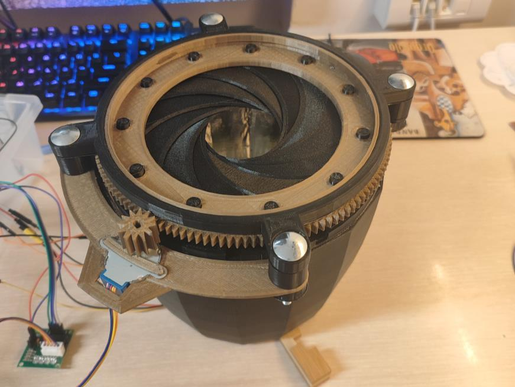
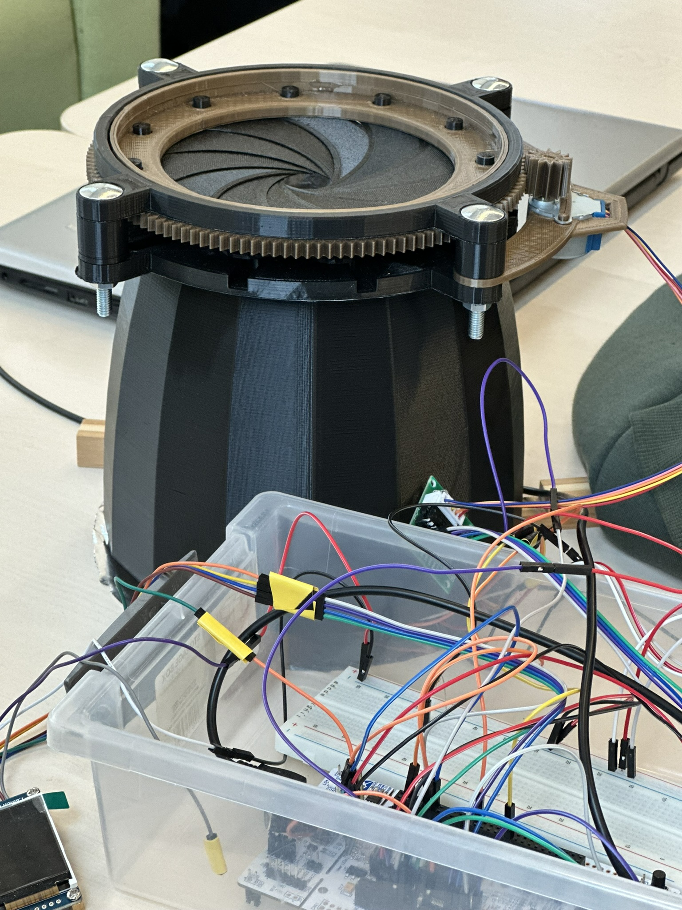
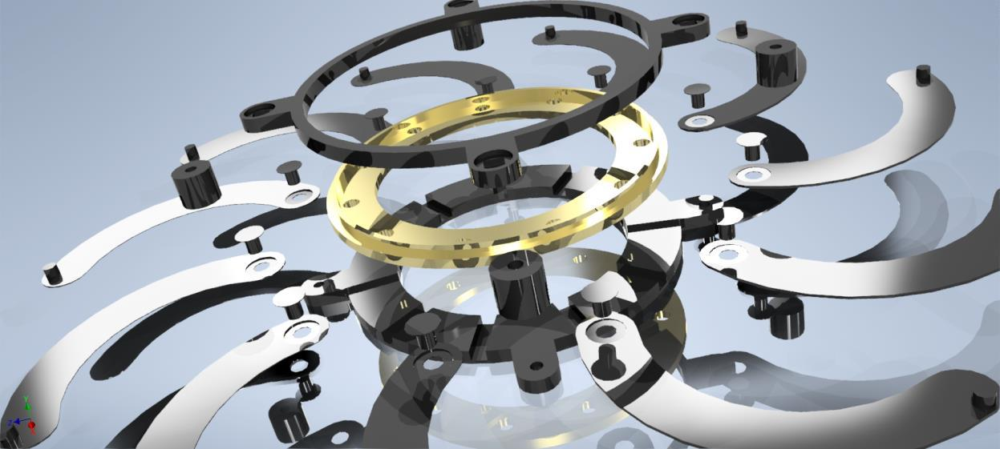
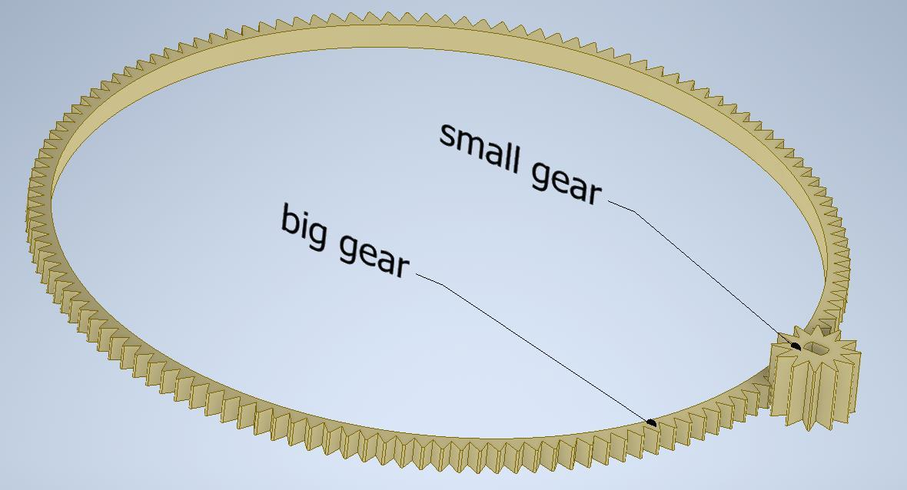
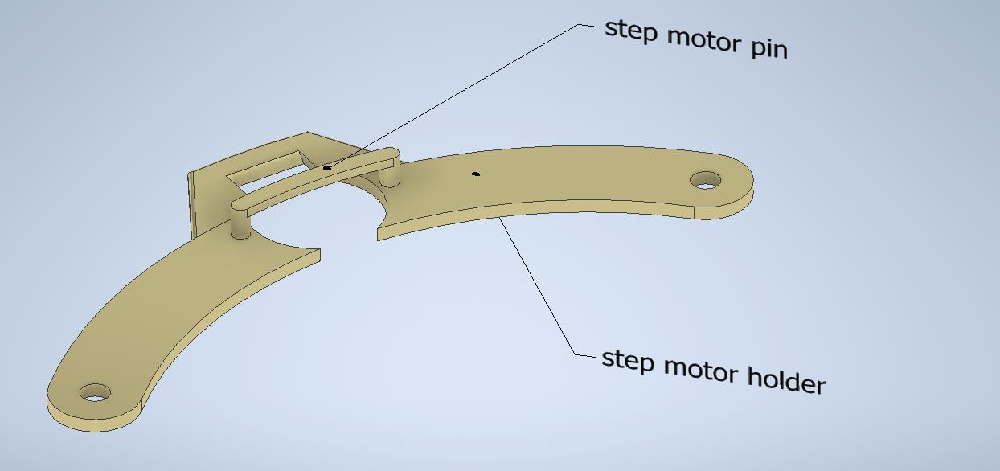
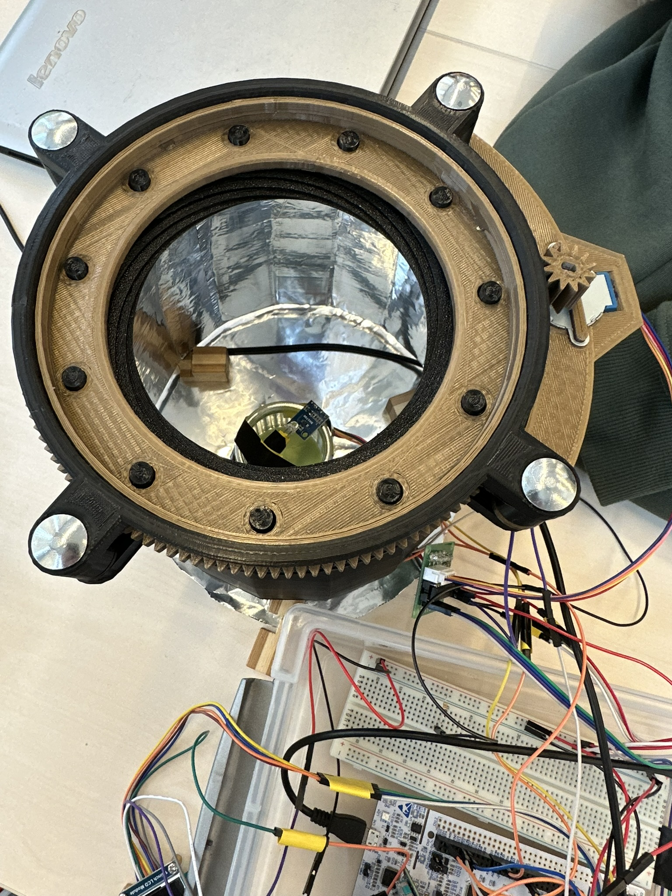
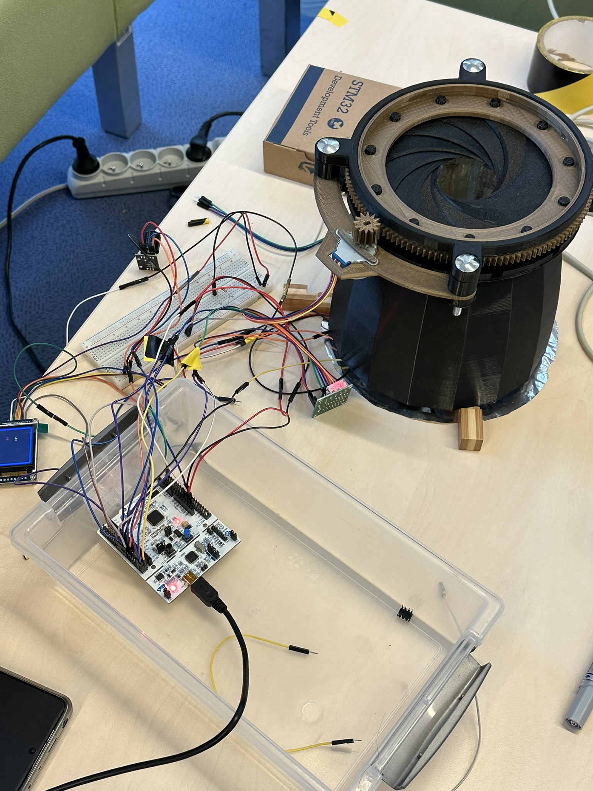
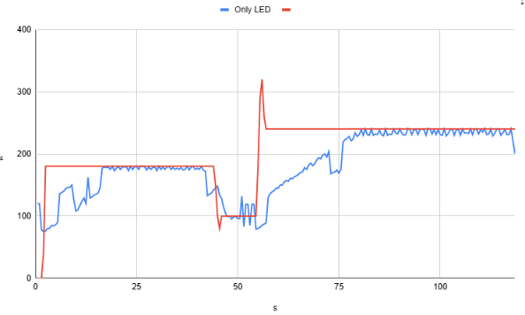
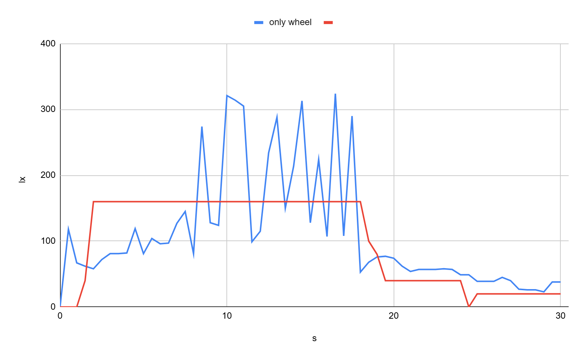
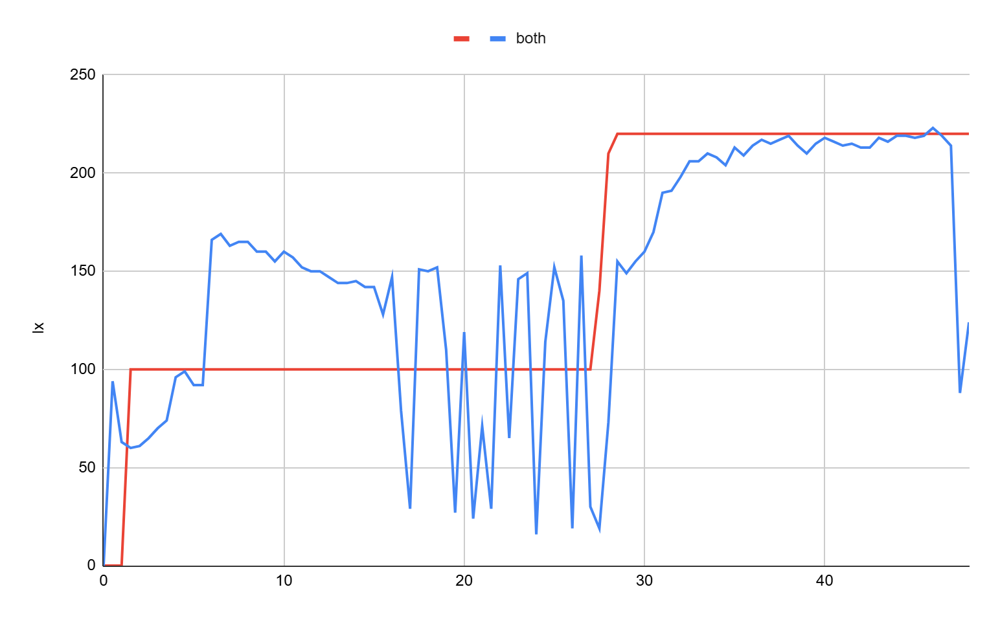

# Mechanical Iris for Light Intensity Control

Microprocessor Systems course project, Poznań University of Technology, 2024/25.  
**Authors:** Piotr Trusiewicz and Michał Pietrzak.

The course assignment was to build an automatic regulation system. Michał and I chose to regulate the light level inside a chamber with a light sensor. A stepper motor opens or closes a printed mechanical iris, and an LED provides additional light when the aperture alone cannot reach the requested value. The target is set with a rotary encoder. An LCD shows the target and the reading from the sensor.

[Demonstration video 1](media/iris-demo-1.mp4) · [Demonstration video 2](media/iris-demo-2.mp4)

## My contribution

This was a team project, and I took part in the overall build and testing. My main responsibility was to choose a practical way to control how much light enters the chamber. I found [sketchpunk's Mechanical Iris](https://www.thingiverse.com/thing:773759) as a starting point, manually recreated and adapted the 3D design in Autodesk Inventor, assembled the mechanism, and fitted the electronic components into the prototype. The work described in our report includes changes to the stepper motor mount, the gear and the iris leaves.

The project and report are credited to both authors. The original iris design and its license are acknowledged in [the source notice](THIRD_PARTY_NOTICE.md).

## How it works

| Part | Role |
| --- | --- |
| Mechanical iris and 28BYJ-48 stepper motor | Adjust the opening of the light chamber |
| ULN2003 driver | Drive the stepper motor |
| BH1750 sensor | Measure light intensity inside the chamber |
| White LED | Add light when the iris reaches its useful limit |
| Rotary encoder | Set the requested light level |
| STM32 Nucleo-L476RG and 1.8-inch LCD | Control the system and display the values |

The motor turns a small gear which drives the larger ring around the iris. The gear ratio reported for this stage was 12:135. The rotating ring moves the leaves and changes the aperture.

The prototype combined printed mechanical parts with a breadboard circuit and the Nucleo board. This photo shows the test setup, not a finished product enclosure.

## Control tests

We compared three ways of approaching the requested light level. The red curves in the plots are setpoints and the blue curves are sensor readings. The plots come from our course report; they show this particular test setup.

| Method | What we observed |
| --- | --- |
| LED only | Small steady-state variation and little overshoot, but a slow response at the higher setpoint. |
| Iris only | Large overshoot and oscillations. Small mechanical movements were difficult to make reliably. |
| Iris and LED together | The first part still showed instability. At the next setpoint the iris reached a useful position and the LED brought the reading close to the target. |

The tests showed why a mechanical aperture and an LED can complement each other, but they also exposed the limitations of the printed mechanism. The iris needed better control of small movements before it could regulate light smoothly on its own.

## Selected CAD files

These Autodesk Inventor part files are from the adapted project. The archive also contains source files from Thingiverse, which are not included here.

| File | Original file name |
| --- | --- |
| [Iris project](models/iris-project.ipt) | `projekt.ipt` |
| [Mount](models/mount.ipt) | `uchwyt.ipt` |
| [Gear](models/gear.ipt) | `zebaty.ipt` |

The Inventor files are design records. They are not a complete build package or tested print instructions. Attribution and non-commercial conditions of the original design still matter for any reuse.

## Report and source

The [full course report](docs/light-intensity-control-report.pdf) contains the circuit connections, more photos, control examples and test plots. It is credited to both project authors. The CAD concept is based on the [original Mechanical Iris by sketchpunk](https://www.thingiverse.com/thing:773759), with changes documented in our report. See [the source notice](THIRD_PARTY_NOTICE.md) before reusing any design files or images.
